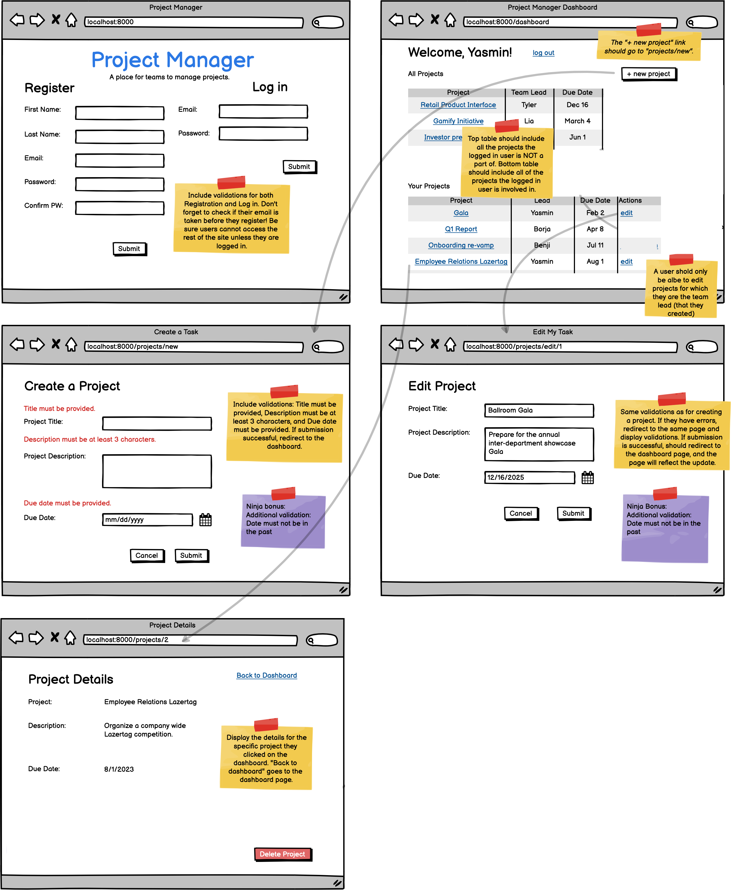

# Belt Review for Java (Revised Project Manager)

## Wireframe

## Requirements
1. Auth
    1. Validation for register & login
    1. Successful register
    1. Successful login
    1. Successful logout
    1. Route protection using the session (no access for logged-out user )
1. CRUD
    1. Create form validation
    1. Successful create with 1:n (logged-in user as the teamlead)
    1. Dashboard that shows all projects
    1. Edit form with validation
    1. Edit form without losing the 1:n relationship
    1. Successful Edit
    1. Successful Delete
1. Database & routing
    1. Follow RESTful routing (PUT for edit, DELETE for delete)
    1. Model with correctly built 1:n relationships

## Full Spring Checklist
**1. Auth & Validations (log & reg)**
- validation (empty form & validation from service)
- successful login & register
- Session check for logged in users to grant access to pages
- being able to logout

**2. Models & Relations**
- Model validations
- Correctly joined 1:n tables

**3. Full CRUD**
- Follow RESTful routing  (Get, Post, Put, Delete)
- Create, Read All, Read one, Edit, Delete
- Form Validation
- Able to create with 1:n relationship
- Edit without losing the 1:n relationship

**4. Achieving Mastery**
- More sophisticated model & logic
- More sophisticated use of session
- Demonstrate more querying capabilities/ using a datatype that is not taught
- Preventing non-owning users from altering data
- custom validations

## Exam

### Requirements & Details
1. completed & submitted 90% of core assignments (10/11)
2. Offical exam day: Week 3 Day 3. (No algo on that day)
3. If you are taking the exam on other dates, you have to attend the algo session first. 
3. Last day of exam: Week 4 Day 3 (Next Wednesday)

### NO CHEATING 
1. Zero-tolerance in cheating. *Students who are found cheating will be expelled from the program immediately*
2. DO NOT find exam on Google/Github 
3. DO NOT communicate with your cohort during the exam

### Available Resources
1. Your own code
2. Platform
3. StackOverflow /Google
4. my github

### Preparations
1. Having a cheatsheet for everything (CRUD)
2. Having a log/reg setup before you get started (log/reg won't accept other tables in most cases)
3. TIPS: DO NOT PRE-BUILD EVERYTHING BEFORE THE EXAM

### During the exam
2. Exam code will be given in the preparation room
2. Stay in your own room on Zoom by yourself
3. If you want to ask for help/grading, send a message on our discord channel and tag @dojo_Heidi_Chen, @dojo_David_Moore

### Getting graded
1. Live grading
2. Finished all Red belt features and get it graded first, then work on the black belt features. 
3. <a href="https://login.codingdojo.com/m/315/9537/81392"> Rubrics </a>

### Red Belt
1. Full CRUD (Create, Read, Update, Delete)
2. One-to-many relationship
3. Login & Registration

### Black Belt: (advanced features) 
1. We don't talk about black belt features 
2. 24 hours to deploy it (dm me with your URL/IP)

